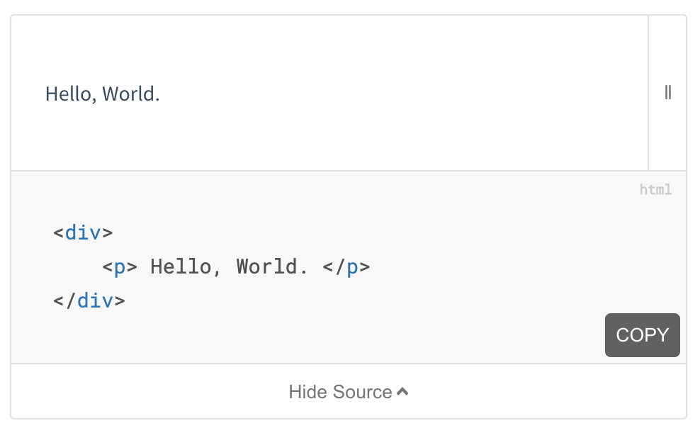

# Docsify Demo 💻
> Plugin for [Docsify](https://docsify.js.org/#/) 📘 that adds a preview of your component

This plugin is focused on testing local code within [Docsify](https://docsify.js.org/#/), based on the [@shoelace](https://github.com/shoelace-style/shoelace) `code-block` implementation. Unlike other [docsify plugins](https://docsify.js.org/#/plugins) that exist, this plugin supports [Lit.Dev](https://lit.dev/). Similar to Storybook, this allows for testing common use cases, but in a simpler way.

This is my first plugin - please feel welcome to suggest features or raise bugs by creating an issue.

## Installation

1. Add the unpkg script
```html
<script src="//unpkg.com/docsify-share/build/index.min.js"></script>
```

2. Add the unpkg styles
```html
<script src="//unpkg.com/docsify-share/build/index.min.js"></script>
```

3. Use the following markdown to add a component to your documentation
```html preview
    ```
    <p> Hello, World. </p>
    ```
```

4. This is what it should look like



## Example

To see the small example in this repo, run `yarn install && yarn build && yarn serve` in the clone.

## License

This plugin uses the MIT License, [summarised here](https://tldrlegal.com/license/mit-license).